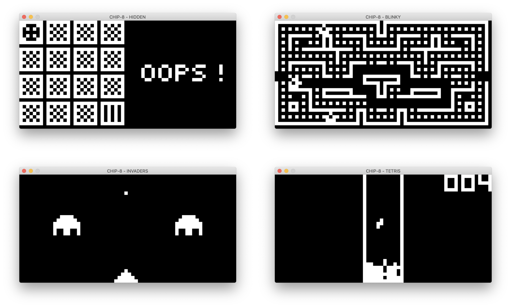

:toc: macro
:toc-title:
:toclevels: 10

= CHIP-8 Interpreter in Rust



CHIP-8 is an interpreted programming language which was initially used on microcomputers in 1970s. It was made to allow video games to be more easily programmed for those computers.

This is a CHIP-8 interpreter written in Rust programming language. It contains 23 built-in CHIP-8 games (see link:programs/[] directory).

---

toc::[]

== Requirements
* Install https://www.rust-lang.org/tools/install[Rust]
* Install https://github.com/Rust-SDL2/rust-sdl2#sdl20-development-libraries[SDL2.0] development libraries (`sdl2` and `sdl2_gfx`)

== Build
```sh
# Debug mode
cargo build

# Release mode
cargo build --release
```

== Run
Run either by using binary built in the previous step, or by executing `cargo run`.

```sh
# Show usage
chip8-interpreter-rust --help

# Run built-in program
chip8-interpreter-rust --program invaders

# Run program from file
chip8-interpreter-rust --program-file /absolute/path/to/program
chip8-interpreter-rust --program-file ../relative/path/to/program
```

== Test
```sh
cargo test
```

== Keyboard
This is the key mapping between modern (QWERTY) keyboard and the original CHIP-8 keypad.

```
QWERTY        |    Original
------------------------------------
1  2  3  4    |    1  2  3  C
Q  W  E  R    |    4  5  6  D
A  S  D  F    |    7  8  9  E
Z  X  C  V    |    A  0  B  F
```

== Resources
* http://devernay.free.fr/hacks/chip8/C8TECH10.HTM[Cowgod's Chip-8 Technical Reference v1.0]
* http://mattmik.com/files/chip8/mastering/chip8.html[Mastering Chip-8 By Matthew Mikolay]
* https://en.wikipedia.org/wiki/CHIP-8[CHIP-8 Wikipedia]
